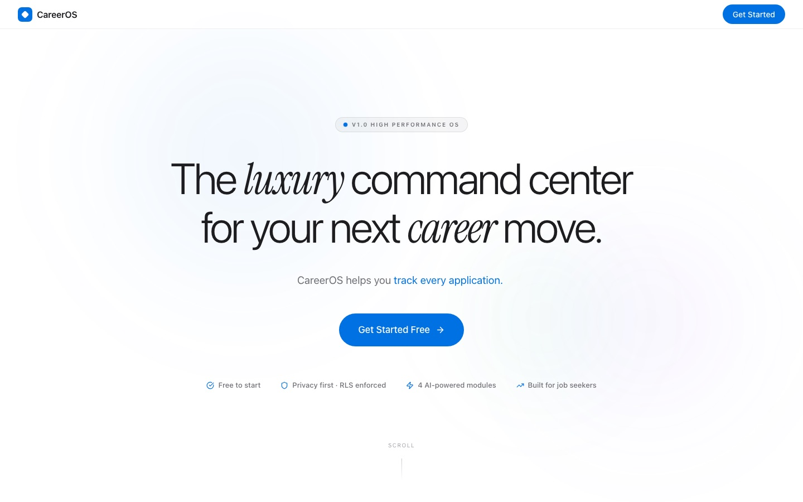
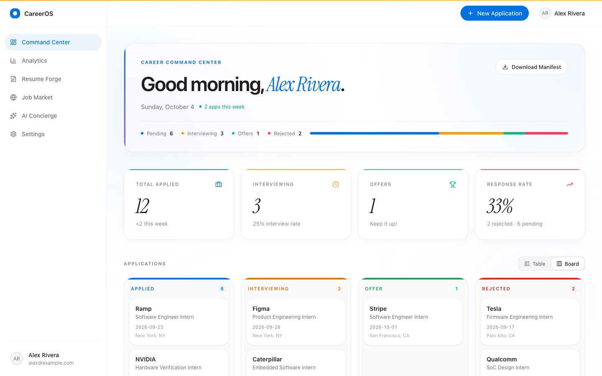
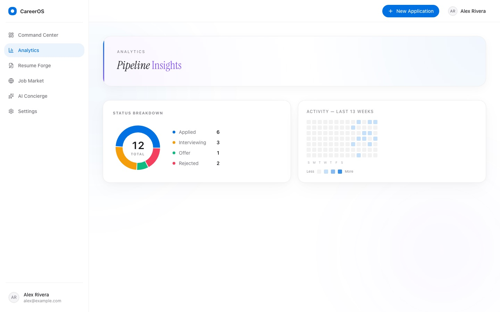
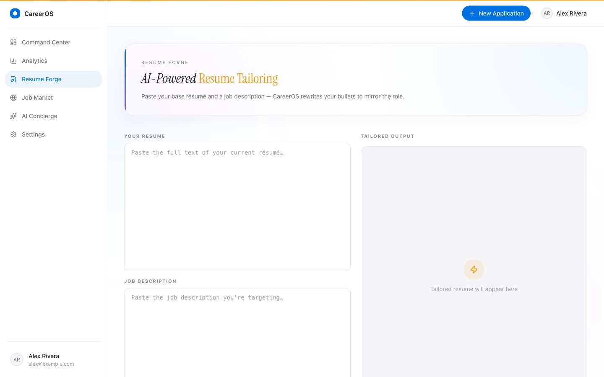
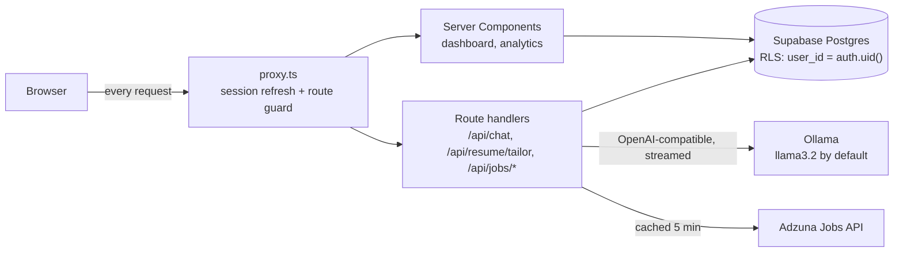

<div align="center">

# CareerOS

**A command center for the job search.** Track every application, tailor your resume to each role with a local LLM, search live listings, and ask an AI coach that can see your whole pipeline.

[](https://github.com/Swarit07/career-os/actions/workflows/ci.yml)


[](LICENSE)


**▶ [Watch the 30-second promo](docs/media/careeros-promo-30s.mp4)**

</div>

## Why

A job search usually lives in a spreadsheet, several copies of a resume, and a dozen job-board tabs. CareerOS puts all of it in one app. Each user's data is isolated by Postgres Row Level Security, and the AI features run on a model you host yourself, so your resume never has to leave your machine.

## Features

| Module | What it does |
|---|---|
| **Command Center** | Stat cards (total, interviewing, offers, response rate), a pipeline progress bar, and your applications as a sortable, filterable **table** or a **kanban board** with one-click status moves. One-click CSV export. |
| **Analytics** | Status donut chart and a GitHub-style activity heatmap of the last 13 weeks. |
| **Resume Forge** | Paste your resume and a job description. The model rewrites your bullets to match the role, streaming the result as it's written. Tailored versions are saved per user. |
| **Job Market** | Live search over the [Adzuna](https://developer.adzuna.com) jobs API with title, company and location autocomplete, type filters, and add-to-pipeline. |
| **AI Concierge** | A streaming chat coach. Each request includes a summary of *your* pipeline, so it can answer "how is my search going?" with real numbers. |
| **Auth** | Supabase email auth, with a Next.js 16 `proxy.ts` gate that protects every authenticated route. |

<table>
  <tr>
    <td width="50%"><p align="center"><sub>Landing page</sub></p></td>
    <td width="50%"><p align="center"><sub>Kanban view</sub></p></td>
  </tr>
  <tr>
    <td width="50%"><p align="center"><sub>Analytics</sub></p></td>
    <td width="50%"><p align="center"><sub>Resume Forge</sub></p></td>
  </tr>
</table>

<sub>Screenshots use sample data for a fictional user.</sub>

## How it works



- **Data isolation in the database, not the app.** `profiles`, `applications` and `resumes` all have Row Level Security policies scoped to `auth.uid()`. A trigger creates a profile row on sign-up. See [`supabase/migrations`](supabase/migrations).
- **Typed end to end.** `src/lib/database.types.ts` mirrors the schema, and both Supabase clients (browser and server) are generic over it.
- **Local-first AI.** The resume and chat routes use the Vercel AI SDK's OpenAI-compatible provider, pointed at Ollama. Swap `OLLAMA_BASE_URL` to use any OpenAI-compatible endpoint.
- **Server-first rendering.** Pages fetch from Supabase in Server Components. Client components are limited to interactive pieces (table, kanban, dialogs, chat).

## Tech stack

**Frontend:** Next.js 16 (App Router, Turbopack), React 19, TypeScript, Tailwind CSS v4, shadcn/ui (Radix), Motion, TanStack Table, Recharts
**Backend:** Supabase (Postgres, Auth, RLS), Next.js route handlers
**AI:** Vercel AI SDK v6 with Ollama (OpenAI-compatible)
**Integrations:** Adzuna Jobs API

## Run it locally

**Prerequisites:** Node 20+, a free [Supabase](https://supabase.com) project, and optionally [Ollama](https://ollama.com) and an [Adzuna](https://developer.adzuna.com) key.

```bash
git clone https://github.com/Swarit07/career-os.git
cd career-os
npm install
cp .env.example .env.local   # then fill in your keys
```

1. In the Supabase SQL editor, run `supabase/migrations/001_initial_schema.sql`, then `002_resumes.sql`.
2. For the AI modules, run `ollama pull llama3.2` and keep Ollama running.
3. Start the dev server:

```bash
npm run dev
```

Open http://localhost:3000, sign up, and add your first application.

| Variable | Required | Purpose |
|---|---|---|
| `NEXT_PUBLIC_SUPABASE_URL` | yes | Supabase project URL |
| `NEXT_PUBLIC_SUPABASE_ANON_KEY` | yes | Supabase anon (public) key |
| `OLLAMA_BASE_URL` / `OLLAMA_MODEL` | for AI | Defaults to `http://localhost:11434/v1` and `llama3.2` |
| `ADZUNA_APP_ID` / `ADZUNA_APP_KEY` | for Job Market | Free developer keys |
| `NEXT_PUBLIC_HERO_VIDEO_URL` | no | Optional HLS background video on the landing page |

## Project structure

```
src/
├── app/
│   ├── (marketing)/        landing page
│   ├── (dashboard)/        dashboard, analytics, resume, jobs, concierge, settings
│   ├── api/                chat, resume/tailor, jobs/search, jobs/locations
│   ├── auth/callback/      Supabase OAuth/email callback
│   └── login/
├── components/ui/          shadcn/ui primitives
├── lib/supabase/           browser + server clients, session middleware
└── proxy.ts                route protection (Next.js 16 replacement for middleware.ts)
supabase/migrations/        schema, RLS policies, triggers
docs/PRD.md                 product requirements doc
```

## Roadmap

- [ ] Deploy a public demo with a seeded read-only account
- [ ] Email reminders for stale applications
- [ ] Resume PDF upload and parsing
- [ ] Hosted-model option alongside Ollama

## License

[MIT](LICENSE) © Swarit Sheel
